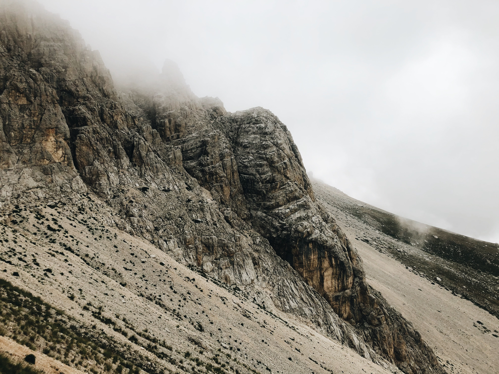
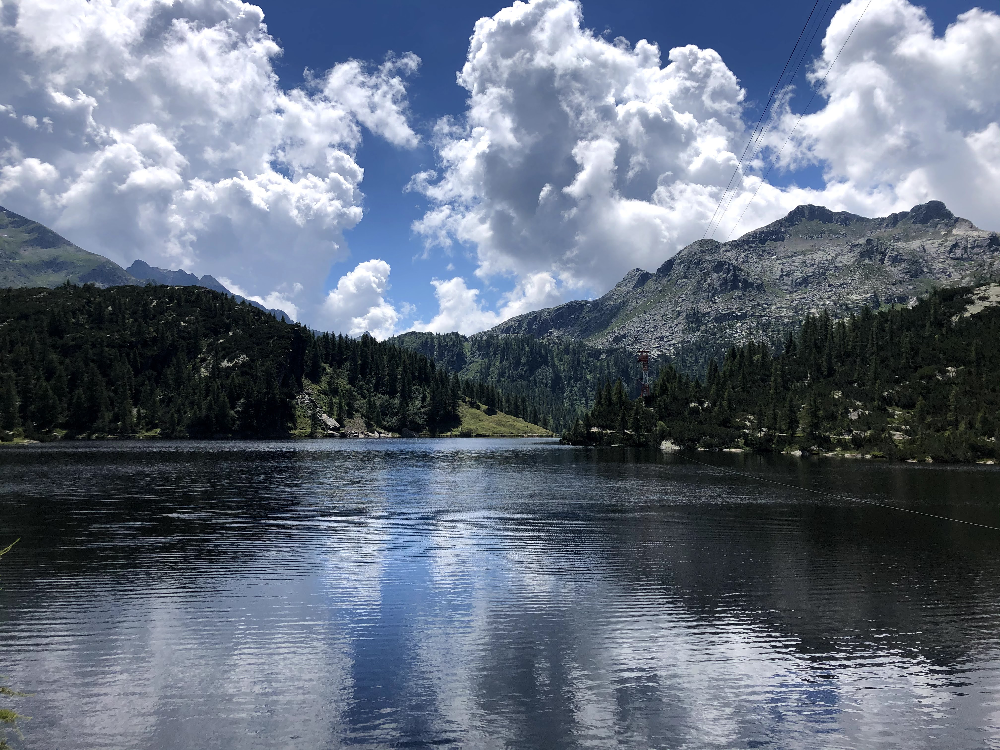

## Miscellaneous
### Hiking, skiing, and snowboarding

**2020**

Cimon della Bagozza. Val di Salve (BG), Italy

Pizzo Camino, Pizzo della Presolana. Val di Scalve (BG), Italy

Gran Sasso d'Italia, Corno Grande (2912m). Gran Sasso e Monti della Laga National Park (AQ), Italy 

Gran Sasso d'Italia. Gran Sasso e Monti della Laga National Park (AQ), Italy

Lago Branchino. Val Brembana (BG), Italy

Pizzo Arera. Val Brembana (BG), Italy

Laghi Gemelli. Val Brembana (BG), Italy

Corna Trenta Passi. Lago d'Iseo (BG), Italy

Pizzo della Presolana. Val di Scalve (BG), Italy

Gleno Dam (collapsed 1923). Val di Scalve (BG), Italy

Foppolo Ski Resort. Val Brembana (BG), Italy

**2019**

**2018**

